# 02 — Technical Architecture

> Derived from `specs/00-canon.md` (technical truth) and `specs/BRIEF.md` (product truth).
> On any detail conflict, `00-canon.md` wins. All identifiers, thresholds, strings, and file
> paths below are copied from the canon — do not rename or re-derive them.
> Implementing agents also follow `CLAUDE.md` at the repo root (Ralph loop, TDD,
> checklists, `PROGRESS.md`).

---

## 1. Overview

Hyperfocus is a menu-bar-less (`LSUIElement`) macOS agent app: a floating Focus Orb, a set of
AppKit overlay windows (countdown, 4-edge aura, cards), a 1 Hz session timer, a local camera
presence pipeline (AVFoundation + Vision), and programmatic audio (speech + brown noise).
All state logic lives in one pure reducer; everything else is thin glue.

Stack (canon §1): Swift 5 language mode, SwiftUI hosted in AppKit windows, deployment target
macOS 15.0, zero third-party dependencies, XcodeGen-generated project, JSON persistence,
`UserDefaults` settings.

### Module dependency diagram (canon §2)

Arrows read "depends on". `Session/` is pure Foundation — it imports no AppKit, AVFoundation,
or file-system APIs (except `SessionStore`, which owns its JSON file).

```mermaid
graph TD
    subgraph App["App/"]
        HyperfocusApp["HyperfocusApp.swift (@main)"]; AppDelegate["AppDelegate.swift"]
        AppState["AppState.swift"]; SessionCoordinator["SessionCoordinator.swift"]
    end
    subgraph Session["Session/ (pure logic + persistence)"]
        SessionReducer["SessionReducer.swift"]; SessionContext["SessionContext / SessionConfig"]
        SessionEnums["SessionState / SessionEvent / SessionEffect"]; SessionModel["SessionModel.swift"]
        SessionTimer["SessionTimer.swift"]; SessionStore["SessionStore.swift"]
    end
    subgraph Orb["Orb/"]
        FocusOrbWindowController["FocusOrbWindowController.swift"]
        FocusOrbView["FocusOrbView.swift"]; OrbPositionStore["OrbPositionStore.swift"]
    end
    subgraph Aura["Aura/"]
        AuraWindowController["AuraWindowController.swift"]
        AuraFrameView["AuraFrameView.swift / AuraState.swift"]
    end
    subgraph UI["UI/"]
        Views["StartSessionView, CountdownOverlayView, ActiveHUDView, AwayModeView, CompletionView, SettingsView, OnboardingView, HistoryView, GlassCard"]
    end
    subgraph Camera["Camera/"]
        PresenceDetecting["PresenceDetecting (protocol)"]
        CameraPresenceService["CameraPresenceService.swift"]
        CameraPermissionService["CameraPermissionService.swift"]
        SimulatedPresenceService["SimulatedPresenceService.swift"]
    end
    subgraph Audio["Audio/"]
        VoicePromptService["VoicePrompting / VoicePromptService.swift"]
        AlarmService["AlarmPlaying / AlarmService.swift"]
    end
    subgraph Utilities["Utilities/"]
        KeyablePanel["KeyablePanel.swift"]; OverlayWindow["OverlayWindow.swift"]
        ScreenManager["ScreenManager.swift"]; SettingsStore["SettingsStore.swift"]
        Constants["Constants.swift"]
    end

    HyperfocusApp --> AppDelegate & AppState
    AppState --> SessionCoordinator
    SessionCoordinator --> SessionReducer & SessionTimer & SessionStore
    SessionCoordinator --> PresenceDetecting & VoicePromptService & AlarmService
    SessionCoordinator --> FocusOrbWindowController & AuraWindowController & Views
    CameraPresenceService -.implements.-> PresenceDetecting
    SimulatedPresenceService -.implements.-> PresenceDetecting
    CameraPresenceService --> CameraPermissionService
    Camera --> SessionEnums
    Audio --> SessionEnums
    Views --> SessionEnums & SettingsStore
    FocusOrbWindowController --> KeyablePanel & OrbPositionStore & ScreenManager
    AuraWindowController --> OverlayWindow & ScreenManager
    AppDelegate --> ScreenManager
```



Locked rules (canon §2): do NOT rename files/types, do NOT merge modules. UI never talks to
services directly — everything flows `event -> reducer -> effects -> coordinator`.

---

## 2. Unidirectional data flow

```
UI / timer / camera / debug menu
        │  SessionEvent
        ▼
SessionReducer.reduce(&ctx, event)      // PURE, synchronous, main thread
        │  [SessionEffect]
        ▼
SessionCoordinator                      // main thread, thin glue
        │
        ├── window controllers (orb, aura, countdown, cards)
        ├── SessionTimer (start/pause/resume/stop)
        ├── PresenceDetecting (warmup/detect/stop)
        ├── VoicePromptService / AlarmService
        └── SessionStore (saveSession)
```

Locked contract (canon §5):

```swift
struct SessionReducer {
    static func reduce(_ ctx: inout SessionContext, _ event: SessionEvent) -> [SessionEffect]
}
```

- `SessionContext` holds the current `SessionState`, `SessionConfig`, and all runtime counters
  (`remainingFocusTime`, `activeFocusSeconds`, `pausedSeconds`, `breakCount`,
  `currentStreakSeconds`, `longestStreakSeconds`, `faceMissingSeconds`, `recoveryElapsed`, …).
- The reducer implements the full transition table of canon §4 (T1–T18) and the timer
  accounting rules. It never touches AppKit, AVFoundation, or the file system.

**Why the reducer is the TDD surface.** It is a pure synchronous function over value types:
given `(ctx, event)` it deterministically returns effects and mutates `ctx`. Every transition
T1–T18, every accounting rule (clamped decrement, sleep gap, streaks, breakCount), and every
corner case (face lost during recovery, exit from countdown) is testable in
`HyperfocusTests/SessionReducerTests.swift` without windows, cameras, or clocks. Per project
CLAUDE.md TDD rules: write the failing reducer test first, then implement the transition.

**What the coordinator is allowed to do** (and nothing more):
1. Execute each `SessionEffect` in order against concrete services and window controllers.
2. Translate callbacks back into events and re-enter `reduce` — timer ticks →
   `.tick(deltaSeconds:)`, `PresenceEvent.facePresent/.faceMissing` →
   `.facePresenceChanged(Bool)`, `PresenceEvent.cameraState(_)` → `.cameraStateChanged(_)`,
   UI button actions → `.userExited` / `.userPaused` / `.resultSaved(…)` etc.
3. Gate audio effects on settings (`hf.voicePromptsEnabled`, `hf.alarmEnabled`) and compute
   the effective alarm volume (`hf.soundVolume` × intensity multiplier, canon §8).
4. On `.saveSession(status)`, build a `Session` value from `SessionContext` and call
   `SessionStore.append(_:)`.
5. Handle the immediate `exited → idle` follow-through (T18) emitted by the reducer.

The coordinator makes **no state decisions**: no `if state == .away` branching, no counter
mutation, no threshold checks. If it needs a branch, that branch belongs in the reducer.
It is deliberately thin, mostly untested glue (canon §5).

---

## 3. App lifecycle

- `Info.plist`: `LSUIElement = true` — no Dock icon, no app switcher entry. The orb and the
  menu bar extra are the only persistent UI.
- `HyperfocusApp.swift` is `@main`: a SwiftUI `App` with
  `@NSApplicationDelegateAdaptor(AppDelegate.self)` and a `MenuBarExtra` scene containing
  Settings…, History, Quit, and (DEBUG builds only) the `Debug` simulation submenu (canon §10).
- `AppDelegate.applicationDidFinishLaunching` bootstraps:
  1. Creates `AppState` wiring (`AppState` owns `SessionCoordinator` and all services;
     coordinator owns window controllers).
  2. Shows the Focus Orb window if `hf.showOrbOnLaunch` is true, restoring position via
     `OrbPositionStore` (clamped to visible bounds).
  3. Registers for `NSApplication.didChangeScreenParametersNotification` (see §4).
  4. Opens the Onboarding window on first launch (`hf.onboardingCompleted == false`).
- Settings, History, and Onboarding are regular SwiftUI `Window` scenes (standard `NSWindow`,
  level `.normal`, default collectionBehavior — canon §3). They are the only windows that
  behave like normal app windows; everything else is a hand-managed AppKit overlay.
- Quit path: menu bar Quit terminates; if a session is running, the coordinator dispatches
  `.userExited` first so the session is saved as `.exited` and the camera/audio are torn down.

---

## 4. Window management

Canon §3 table is the contract. Expansion per window:

| Window | Class / config | Created / destroyed | Owner | Ordering & focus |
|---|---|---|---|---|
| Focus Orb | `KeyablePanel`, `[.borderless, .nonactivatingPanel]`, level `.statusBar`, `ignoresMouseEvents = false`, `[.canJoinAllSpaces, .fullScreenAuxiliary]` | Created at launch (if `hf.showOrbOnLaunch`), lives for app lifetime; hidden (not destroyed) by "Hide for 10 minutes" | `FocusOrbWindowController`, retained by coordinator/AppState | `orderFrontRegardless()`; never `makeKey` (orb takes no keyboard input) |
| Start card | `KeyablePanel`, same styleMask/level/behavior, positioned next to orb | Created on `.showStartCard`, closed on `.hideStartCard` | `SessionCoordinator` (controller retained while visible) | `makeKeyAndOrderFront` — must be key so the mission text field types |
| Countdown | borderless `NSWindow` sized to main screen frame, `[.borderless]`, level `.screenSaver` | Created on `.showCountdown`, destroyed on `.dismissCountdown` | `SessionCoordinator` | `orderFrontRegardless()`; darkens screen (respect `hf.darkenScreenOnStart`) |
| Aura ×4 | borderless `NSWindow` per edge via `OverlayWindow` factory, level `.statusBar`, `ignoresMouseEvents = true`, `[.canJoinAllSpaces, .fullScreenAuxiliary, .stationary]` | Created on first `.setAura(.green)`, kept alive across state changes, destroyed on `.setAura(.hidden)` / after `.flashThenHide`; rebuilt on screen change | `AuraWindowController` (owns all 4) | `orderFrontRegardless()` only; NEVER `makeKey` — auras must never steal focus |
| Away card | `KeyablePanel`, centered, level `.screenSaver` | `.showAwayCard` / `.hideAwayCard` | `SessionCoordinator` | key panel (Return/Exit buttons clickable above countdown-level content) |
| Completion card | `KeyablePanel`, centered, level `.floating` | `.showCompletion` / `.hideCompletion` | `SessionCoordinator` | key panel (buttons + `Next action` text field) |
| Settings / History / Onboarding | standard `NSWindow` (SwiftUI `Window` scenes), level `.normal` | Managed by SwiftUI scene lifecycle | SwiftUI | normal activation |

Mandatory AppKit gotchas (canon §3 — implement exactly, don't rediscover):

1. **KeyablePanel gotcha:** borderless panels can't take keyboard focus by default.
   `Utilities/KeyablePanel.swift` overrides `canBecomeKey` to return `true`. Without it the
   mission text field in the Start card silently ignores typing.
2. All overlay windows: `isOpaque = false`, `backgroundColor = .clear`, `hasShadow = false` —
   except cards (Start/Away/Completion), which set `hasShadow = true`.
3. **Click-through aura:** `ignoresMouseEvents = true` plus `.stationary` behavior; the aura
   must never intercept clicks or scroll. Order with `orderFrontRegardless()` — never
   `makeKey`, never `NSApp.activate`.
4. **Orb drag:** implemented in the view via `NSEvent` mouse tracking that moves the panel's
   frame — NOT `isMovableByWindowBackground` (it breaks click detection). Click = `mouseUp`
   with < 4 pt total movement and < 0.3 s duration; anything else is a drag.
5. **Edge snap:** after drag ends, if the orb center is within **32 pt** of a screen edge,
   animate the frame to an **8 pt** margin from that edge. Persist via `OrbPositionStore`.
6. **Screen-change handling:** on `NSApplication.didChangeScreenParametersNotification`,
   clamp the orb into `NSScreen.main.visibleFrame` and rebuild the aura windows.
7. **Single-screen policy:** MVP targets `NSScreen.main` captured at the moment the session
   starts — countdown, aura, and cards all use that screen. No multi-screen aura.

Aura geometry (canon §3): each edge window is a strip **120 pt** thick (× `hf.auraThickness`
multiplier 0.5–1.5), spanning the full edge, drawn as a linear gradient from
`edgeColor.opacity(0.55 × auraIntensity)` at the screen edge to `.clear` inward. Corners
overlap; acceptable.

---

## 5. Timer engine

`Session/SessionTimer.swift` — a 1 Hz tick source, nothing else:

```swift
final class SessionTimer {
    var onTick: ((Double) -> Void)?   // deltaSeconds, delivered on main
    func start()
    func stop()
}
```

- Fires 1 Hz on the main run loop (a `Timer` in `.common` run-loop mode so it ticks during
  window drags).
- Each tick computes `deltaSeconds` from a **monotonic clock** (`ContinuousClock` /
  `CACurrentMediaTime()`), never wall clock — the wall clock jumps on NTP sync and timezone
  changes.
- The timer does **no accounting**. The coordinator forwards each tick as
  `.tick(deltaSeconds: delta)` into the reducer, which applies the locked rules (canon §4):
  - Per-tick decrement of `remainingFocusTime` is **clamped to 1 second**.
  - If `delta > 5 s` (machine slept, app stalled), the excess goes to `pausedSeconds`, not
    focus time.
  - `remainingFocusTime` decreases and `activeFocusSeconds` increases only in `active` and
    `warning`. `pausedSeconds` accrues in `away`, `recovering`, `manualPaused`.
  - `faceMissingSeconds` and `recoveryElapsed` also advance on ticks, which is how the
    7 s warning / 15 s away / 3 s recovery thresholds are evaluated (T6, T8, T12).
- `.pauseTimer` / `.resumeTimer` effects map to `stop()` / `start()`; pause bookkeeping lives
  in the reducer, not the timer. `SessionTimer` is unit-tested for delta correctness in
  `SessionTimerTests.swift`; threshold logic is tested through the reducer.

---

## 6. Camera pipeline

`Camera/CameraPresenceService.swift` implements the locked protocol (canon §6):

```swift
protocol PresenceDetecting: AnyObject {
    var onEvent: ((PresenceEvent) -> Void)? { get set }  // delivered on main thread
    func startWarmup()          // pre-roll camera during countdown
    func startDetection()
    func stop()
}

enum PresenceEvent: Equatable {
    case facePresent
    case faceMissing
    case cameraState(CameraState)
}
```

**Capture configuration.**
- `AVCaptureSession` with `sessionPreset = .vga640x480` — enough for face rectangles, low
  CPU/power.
- Input: default video `AVCaptureDeviceInput`. Output: `AVCaptureVideoDataOutput` with
  `alwaysDiscardsLateVideoFrames = true`, sample-buffer delegate on the serial queue
  `com.hyperfocus.camera`. All session configuration/start/stop also happens on that queue.

**Vision throttling.** `VNDetectFaceRectanglesRequest` runs at most every 0.5 s (**2 Hz**);
frames arriving in between are dropped (compare against the last analysis timestamp on the
camera queue). Raw flicker shorter than one detection interval is absorbed for free by the
reducer's `faceMissingSeconds` accounting (canon §4) — no extra debounce layer.

**Event-on-change-only.** The service tracks the last emitted presence value and emits
`.facePresent` / `.faceMissing` only when the detected value CHANGES, plus exactly one
initial value after `startDetection()`. The reducer, not the service, turns raw presence into
warning/away/recovering via tick accumulation.

**Warmup.** Effect `.startCameraWarmup` fires on T3 (`enterHyperfocus`): the capture session
is configured and started during the countdown so the first real frame is ready by
`countdownCompleted`. Warmup emits no presence events; `.startPresenceDetection` (T4) enables
emission.

**Permission flows** (via `CameraPermissionService`, `AVCaptureDevice.authorizationStatus` /
`requestAccess(for: .video)`):
- **Never asked** (`.notDetermined`): request at the first camera session start (per BRIEF:
  check permission at session start; if missing, ask).
- **Denied / restricted**: offer a no-camera session (`hf.allowSessionsWithoutCamera`,
  default true) — timer runs, manual pause/resume only, HUD shows `Camera off`. Emit
  `.cameraState(.notAuthorized)` so the HUD can show `Permission needed` where relevant
  (Settings → Camera shows status + link to System Settings).
- **Revoked mid-session** (or device disconnected): treat as camera unavailable. Service
  emits `.cameraState(.unavailable)`; coordinator dispatches
  `.cameraStateChanged(.unavailable)`. Reducer response per canon §4 "Camera degradation
  mid-session" (matches 03 §5): in `active` — stay in active, presence-driven transitions
  disabled, timer keeps running, HUD `Camera off`; in `warning` — return to active applying
  T7's effect list, `faceMissingSeconds` resets; in `away`/`recovering` — treated exactly as
  `facePresenceChanged(true)`: away → recovering (T10), then after `recoverySeconds` → active
  (T12 — alarm stops, timer resumes). The session continues no-camera (the HUD status change
  is how the user is informed; no shaming copy).

**Teardown checklist** (on `.stopCamera` effect and in `stop()`):
1. `session.stopRunning()` (on `com.hyperfocus.camera`).
2. Remove all inputs and outputs from the session.
3. Nil the sample-buffer delegate (`setSampleBufferDelegate(nil, queue: nil)`).
4. Release the session and Vision request objects; clear pending emission state.

Privacy invariants for this module are in §12. `SimulatedPresenceService` implements the same
protocol, driven by the DEBUG menu (canon §10), and must exercise the full
green → yellow → red → alarm → recovery → completion flow with no camera.

---

## 7. Audio

### VoicePromptService (`Audio/VoicePromptService.swift`)

```swift
protocol VoicePrompting: AnyObject {
    func speak(_ line: VoiceLine, style: VoiceStyle)
    func stopSpeaking()
}
```

- One retained `AVSpeechSynthesizer` instance (deallocating mid-utterance kills speech).
- `VoiceLine → string` mapping is the copy canon (§9), exact:
  - `.countdown` → `Enter Hyperfocus Mode. Three. Two. One. Focus.`
  - `.away` → `Session paused. Return to Hyperfocus or exit.`
  - `.restored` → `Focus restored.`
  - `.complete` → `Mission complete.`
- Style parameters (canon §6, locked):

| VoiceStyle | rate | pitchMultiplier | notes |
|---|---|---|---|
| `.calm` | 0.45 | 1.0 | default `AVSpeechSynthesisVoice` en-US |
| `.strict` | 0.52 | 0.95 | slightly faster, flatter |
| `.cinematic` | 0.42 | 0.85 | slower, lower — "sci-fi" |

- Utterance volume follows `hf.soundVolume`. The coordinator gates all `.playVoice` effects on
  `hf.voicePromptsEnabled` and picks the style from the session's intensity mapping (canon §8:
  calm→calm, strict→strict, cinematic→cinematic).
- `stopSpeaking()` calls `stopSpeaking(at: .immediate)` — used on exit so no prompt outlives
  the session.

### AlarmService (`Audio/AlarmService.swift`)

```swift
protocol AlarmPlaying: AnyObject {
    func start(volume: Float)
    func stop()
    var isPlaying: Bool { get }
}
```

- `AVAudioEngine` + `AVAudioSourceNode` rendering **brown noise** programmatically — no audio
  assets in the repo. Render block per canon §6:
  `brown += (white - brown * 0.02); sample = brown * 3.5 × volume`, clamped to `[-1, 1]`,
  routed through `AVAudioEngine.mainMixerNode`.
- **Fade in over 0.8 s** (ramp the gain inside the render block or via mixer volume ramp);
  loops indefinitely until `stop()`, which stops **immediately** (no fade-out) — the alarm
  must cut the instant recovery completes (T12) or the user exits (T16).
- Effective volume = `hf.soundVolume` × intensity alarm multiplier (canon §8: calm 0.7×,
  strict 1.1×, cinematic 1.0×), computed by the coordinator; gated on `hf.alarmEnabled`.
- Render-block discipline: the block runs on the audio render thread — no allocation, no
  locks, no Objective-C messaging inside it; state is plain captured floats.

---

## 8. Persistence

### SessionStore (`Session/SessionStore.swift`)

- Persists `[Session]` (locked model, canon §7) as pretty-printed JSON at
  `FileManager.applicationSupportDirectory/Hyperfocus/sessions.json`; creates the directory
  if missing. Under App Sandbox this resolves on disk to
  `~/Library/Containers/com.hyperfocus.app/Data/Library/Application Support/Hyperfocus/sessions.json`
  — use the container path for manual verification (canon §7).
- API: `append(_:)`, `all()`, `clear()`.
- **Injectable directory URL** in the initializer so `SessionStoreTests.swift` writes to a
  temporary directory — never the real Application Support path.
- Load once at init; `append` rewrites the whole file (one small array — simplicity beats
  cleverness here, per canon §1 rationale).
- Write failures are non-fatal: see §11.

### SettingsStore (`Utilities/SettingsStore.swift`)

- Typed wrapper over `UserDefaults` exposing every canon §8 key (all 22 `hf.*` keys — use the
  exact literals and defaults from the canon table). No `register(defaults:)`: each typed
  accessor falls back to its canon default when the key is unset
  (`defaults.object(forKey:) as? T ?? fallback`), matching the implemented `SettingsStore`.
- Key literals and defaults live in `Utilities/Constants.swift` — single source; no scattered
  string literals.
- `SettingsView` binds via `@AppStorage`/`SettingsStore`; the reducer receives thresholds
  through `SessionContext`/`SessionConfig` at session start (a running session is not
  reconfigured mid-flight by settings edits).
- `hf.orbPosition` (JSON `{x,y}`) is owned by `OrbPositionStore`, which clamps restored
  positions to `NSScreen.main.visibleFrame`.

---

## 9. Threading model

| Work | Queue/thread |
|---|---|
| `SessionReducer.reduce`, `SessionCoordinator`, all window/AppKit calls, SwiftUI state | main thread only |
| `SessionTimer` ticks | main run loop |
| AVCaptureSession config/start/stop, sample-buffer delegate, Vision requests | `com.hyperfocus.camera` (serial `DispatchQueue`) |
| Brown-noise render block | audio render thread (real-time; no locks/allocations) |
| `AVSpeechSynthesizer` / `AVAudioEngine` control calls | main thread |

The single crossing point: `CameraPresenceService` computes presence on the camera queue and
delivers via `DispatchQueue.main.async { self.onEvent?(event) }` **inside the service** —
the coordinator never thinks about threads and can assume every `SessionEvent` arrives on
main. This is the canon §2 rule "presence events delivered to main" made concrete.
`SessionStore` writes happen on the main thread (file is tiny); if this ever measures as a
stall, move the write behind a serial utility queue — but do not change the API.

---

## 10. Memory management

- **`[weak self]` in every long-lived closure**: `PresenceDetecting.onEvent`,
  `SessionTimer.onTick`, notification observers, `DispatchQueue.main.async` hops inside
  services. Services must never retain the coordinator (cycle: coordinator → service →
  onEvent → coordinator).
- **Capture session teardown** (§6 checklist) breaks the delegate retain chain; verify with
  Instruments/`deinit` logging that `CameraPresenceService` internals release after
  `.stopCamera`.
- **Window controllers are strongly retained** by `AppState`/`SessionCoordinator` for their
  documented lifetime (§4). Transient controllers (start card, countdown, away card,
  completion card) are released when their hide/dismiss effect executes — an unretained
  `NSWindowController` closes its window out from under you.
- **Timers**: `SessionTimer.stop()` invalidates the underlying `Timer` (a scheduled `Timer`
  retains its target/closure and leaks otherwise). Same for any UI animation timers in
  countdown/recovery views.
- Remove `didChangeScreenParametersNotification` observers in `deinit` (or use the
  token-based API and store the token).

---

## 11. Error handling matrix

| Failure | Detection | Behavior (locked) |
|---|---|---|
| Camera not authorized (denied/restricted) | `CameraPermissionService` at session start | Offer no-camera session (`hf.allowSessionsWithoutCamera`); HUD `Camera off` / `Permission needed`; Settings → Camera shows status |
| Camera unavailable (no device) | capture setup fails | Same no-camera fallback; emit `.cameraState(.unavailable)` |
| Camera disabled by user (`hf.useCameraForPresence = false`) | settings read at session start | Session starts without presence detection; HUD `Camera off` |
| Camera revoked / disconnected mid-session | capture error / device-disconnect on camera queue | Emit `.cameraState(.unavailable)` → `.cameraStateChanged`; per-state rule (canon §4): active stays active (presence transitions disabled, timer runs); warning → active (T7 effects, `faceMissingSeconds` resets); away/recovering → treated as `facePresenceChanged(true)` (T10, then T12 after `recoverySeconds` — alarm stops, timer resumes); HUD `Camera off` |
| Speech synth failure | `AVSpeechSynthesizer` error/no-op | Silent degrade — session continues, visuals carry the meaning; no user-facing error |
| Audio engine failure (e.g. `engine.start()` throws) | thrown error in `AlarmService.start` | Silent degrade, log via `os.Logger`; away state still shows red aura + card |
| Storage write failure | thrown error in `SessionStore` save | Keep sessions in memory, log, non-fatal; retry on next `append` |
| Screen layout change | `didChangeScreenParametersNotification` | Clamp orb into visible bounds; rebuild aura windows (§4) |

Never surface raw error text in session UI; tone rules (canon §9) apply everywhere, including
logs surfaced to the user.

---

## 12. Privacy enforcement

Privacy invariants (canon §6, BRIEF "Правила privacy") are enforced by construction and
checked in every code review:

**Forbidden in the entire `Hyperfocus` app target:**
- `AVCaptureMovieFileOutput`, `AVCapturePhotoOutput`, `AVAssetWriter` — no recording, ever.
- Any persistence of pixel data: no writing `CVPixelBuffer`/`CGImage`/`CIImage` to disk, no
  `CGImageDestination`, no `jpegData`/`pngData`/`tiffRepresentation` on camera frames.
  Pixel buffers exist only transiently inside `CameraPresenceService` on the camera queue
  and are handed to `VNImageRequestHandler`, nothing else.
- `URLSession`, `Network` framework, sockets — no network calls anywhere in the app target.
  The entitlements file has **no network entitlements** (canon §11), so a violation also
  fails at runtime under the sandbox.
- Identity recognition, emotion detection, face landmarks beyond
  `VNDetectFaceRectanglesRequest`.

**Review check (run before merging any camera/audio/persistence change):**

```bash
grep -rnE "AVCaptureMovieFileOutput|AVCapturePhotoOutput|AVAssetWriter" Hyperfocus/
grep -rnE "URLSession|import Network|NWConnection" Hyperfocus/
grep -rnE "CGImageDestination|jpegData|pngData|tiffRepresentation" Hyperfocus/
grep -rn  "VN" Hyperfocus/ | grep -v "VNDetectFaceRectanglesRequest\|VNImageRequestHandler\|VNFaceObservation\|VNRequest"
```

All four must return nothing (last one: no Vision usage beyond face rectangles and their
observations). Camera is
torn down on session end (§6 checklist) — verify the camera indicator LED turns off.
User-facing privacy copy is locked in canon §9 and `NSCameraUsageDescription` in canon §11.

---

## 13. Build system

- **`project.yml` (XcodeGen) is the source of truth.** `Hyperfocus.xcodeproj` is generated
  and git-ignored — never hand-edit or commit it.
- Targets:
  - `Hyperfocus` — macOS app. Settings per canon §1/§11: `SWIFT_VERSION: 5.0`,
    `SWIFT_STRICT_CONCURRENCY: minimal`, deployment target macOS 15.0, bundle id
    `com.hyperfocus.app`, `LSUIElement = true`, `NSCameraUsageDescription` (canon §11 string),
    App Sandbox enabled with `com.apple.security.device.camera = true`, no network
    entitlements, automatic signing (local dev team / "Sign to Run Locally").
  - `HyperfocusTests` — XCTest unit bundle hosted by the app, containing
    `SessionReducerTests.swift`, `SessionTimerTests.swift`, `SessionStoreTests.swift`,
    `OrbPositionStoreTests.swift`.
- No third-party dependencies of any kind (canon §1) — Apple frameworks only.

Commands (canon §1, must stay true):

```bash
brew install xcodegen        # once
xcodegen generate            # regenerates Hyperfocus.xcodeproj from project.yml
xcodebuild -project Hyperfocus.xcodeproj -scheme Hyperfocus -configuration Debug build
xcodebuild -project Hyperfocus.xcodeproj -scheme Hyperfocus test
open Hyperfocus.xcodeproj    # or run from Xcode
```

Adding a file = add it under the canon §2 directory layout, then re-run `xcodegen generate`
(project.yml globs the source tree). CI-equivalent local gate before every commit: build +
tests green (`xcodebuild … test`), per CLAUDE.md Definition of Done.
