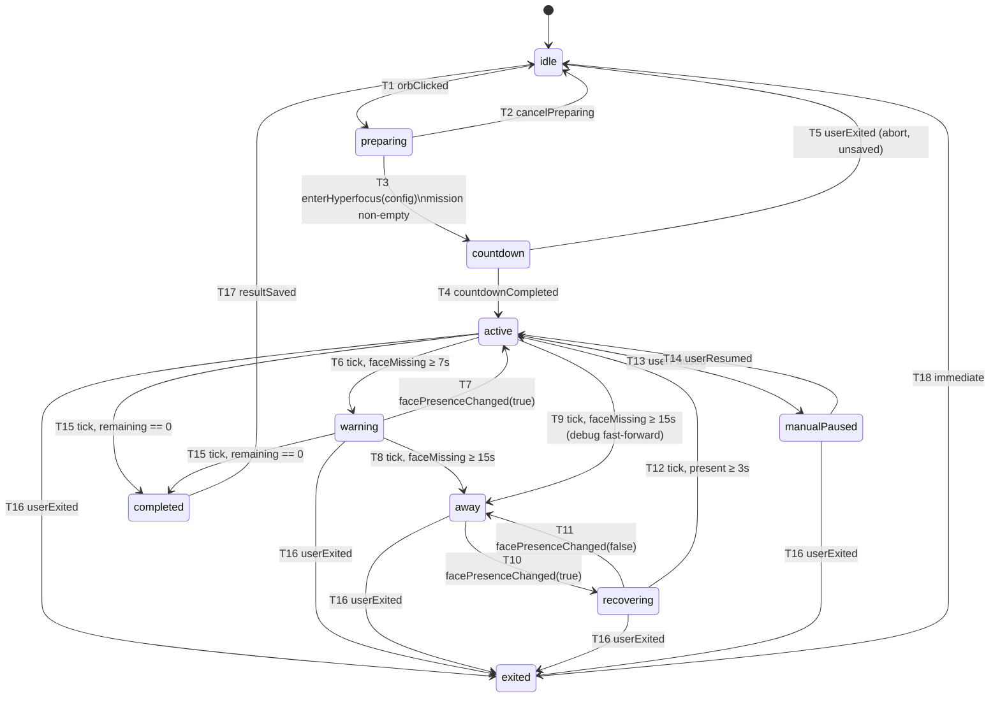

# 03 — State Machine & Timing Specification

> Derived from `specs/00-canon.md` §4–§5 (technical truth) and `specs/BRIEF.md` (product truth).
> On any detail conflict, `00-canon.md` wins. All identifiers, thresholds, effect names, and copy
> strings here are the canon's exact ones. The reducer described here is
> `Hyperfocus/Session/SessionReducer.swift` — a pure, synchronous, main-thread function
> `(inout SessionContext, SessionEvent) -> [SessionEffect]` — and is the primary TDD surface
> (`HyperfocusTests/SessionReducerTests.swift`).

Timing constants (defaults, user-tunable via `SettingsStore`, canon §8):
`warningThresholdSeconds = 7`, `awayThresholdSeconds = 15`, `recoverySeconds = 3`.

---

## 1. State enum

```swift
enum SessionState: String, Codable {
    case idle, preparing, countdown, active, warning, away,
         recovering, manualPaused, completed, exited
}
```

- **idle** — No session exists. The Focus Orb is visible in its glass idle look, no aura is shown, the camera is off, no timer runs, and no session counters exist. The only session-relevant input is a click on the orb. `.tick` and presence events arriving in idle are ignored.
- **preparing** — The "Prepare Hyperfocus" start card is visible next to the orb. The user types the Mission (required), optional Success condition, picks duration (5/15/25/45 min or Custom 1–180) and Intensity (calm/strict/cinematic). No timer, no camera, no aura. Exits via `Enter Hyperfocus` (valid mission) or `Cancel`.
- **countdown** — Fullscreen countdown overlay (`ENTER HYPERFOCUS MODE` → `3` → `2` → `1` → `FOCUS`), screen darkened, voice line `Enter Hyperfocus Mode. Three. Two. One. Focus.` playing. The camera is warming up (`startWarmup`) so the first presence reading is ready when the session goes active. `SessionTimer` has not started; no counters accrue. The user can abort (nothing is saved).
- **active** — The working state. Green aura, `SessionTimer` ticking at 1 Hz, `remainingFocusTime` counting down, `activeFocusSeconds` and `currentStreakSeconds` counting up. Face is present — or the session is a no-camera session, in which case presence never influences state. HUD status: `Present` (or `Camera off`).
- **warning** — Face has been missing for at least `warningThresholdSeconds` but less than `awayThresholdSeconds`. Yellow aura. **The timer still runs**: `remainingFocusTime` keeps decreasing and `activeFocusSeconds`/`currentStreakSeconds` keep increasing. HUD status: `Looking for you`. Returns to active instantly on a face-present event; falls to away at the away threshold.
- **away** — Face missing for at least `awayThresholdSeconds`. Red aura, timer paused (`pausedSeconds` accrues), brown-noise alarm looping, voice line `Session paused. Return to Hyperfocus or exit.` spoken once on entry, away card visible (title `Session paused`, text `Return to Hyperfocus or exit the session.`, buttons `Return` / `Exit Session`). `breakCount` was incremented and `currentStreakSeconds` reset on entry.
- **recovering** — Face is visible again after away. The recovery countdown (`3` → `2` → `1` → `Back to focus`) is shown over/in the away card. The alarm keeps playing, the timer is still paused (`pausedSeconds` accrues). After `recoverySeconds` of continuous presence the session returns to active; if the face is lost again, back to away.
- **manualPaused** — The user paused via orb quick action / HUD. Timer paused (`pausedSeconds` accrues), aura dimmed, no alarm. `currentStreakSeconds` was reset on entry; `breakCount` was NOT incremented. Presence events change nothing here. Exits via resume or exit.
- **completed** — `remainingFocusTime` reached 0. Timer stopped, camera stopped, aura flashed green then hid, voice line `Mission complete.` spoken, completion card visible (Mission / Focus time / Paused time / Breaks / Longest streak, question `Did you complete the mission?`, buttons `Done` / `Partial` / `Not done`, optional `Next action`). Waits for the user's result.
- **exited** — Transient state: the user ended the session early from any running state. The session is saved with `completionStatus = .exited`, camera and alarm stopped, aura hidden. The reducer immediately emits T18 to idle within the same `reduce` call; `exited` is never observed across run-loop turns.

---

## 2. Transition diagram



---

## 3. Transition table (canon §4) + implementation detail

Test names here are informal references; the authoritative catalog is `specs/06-testing.md` §4 (D5).

| # | From | Event / condition | To | Key effects |
|---|---|---|---|---|
| T1 | idle | `.orbClicked` | preparing | `.showStartCard` |
| T2 | preparing | `.cancelPreparing` | idle | `.hideStartCard` |
| T3 | preparing | `.enterHyperfocus(config)` (mission non-empty) | countdown | `.hideStartCard`, `.showCountdown`, `.playVoice(.countdown)`, `.startCameraWarmup` |
| T4 | countdown | `.countdownCompleted` | active | `.dismissCountdown`, `.setAura(.green)`, `.startTimer`, `.startPresenceDetection` |
| T5 | countdown | `.userExited` | idle | `.dismissCountdown`, `.stopCamera` (abort, nothing saved) |
| T6 | active | `.tick` while `ctx.faceMissingSeconds ≥ warningThreshold` | warning | `.setAura(.yellow)` |
| T7 | warning | `.facePresenceChanged(true)` | active | `.setAura(.green)` (no recovery delay; counter resets) |
| T8 | warning | `.tick` while `ctx.faceMissingSeconds ≥ awayThreshold` | away | `.setAura(.red)`, `.pauseTimer`, `.startAlarm`, `.playVoice(.away)`, `.showAwayCard`; `ctx.breakCount += 1`; streak resets |
| T9 | active | direct away condition (e.g. debug `.simulateAway`) | away | same as T8 |
| T10 | away | `.facePresenceChanged(true)` | recovering | `.showRecoveryCountdown` (alarm keeps playing) |
| T11 | recovering | `.facePresenceChanged(false)` | away | `.hideRecoveryCountdown` |
| T12 | recovering | `.tick` while face present and `ctx.recoveryElapsed ≥ recoverySeconds` | active | `.stopAlarm`, `.hideAwayCard`, `.hideRecoveryCountdown`, `.setAura(.green)`, `.resumeTimer`, `.playVoice(.restored)` |
| T13 | active | `.userPaused` | manualPaused | `.pauseTimer`, `.setAura(.dimmed)` |
| T14 | manualPaused | `.userResumed` | active | `.resumeTimer`, `.setAura(.green)` |
| T15 | active / warning | `.tick` when `remainingFocusTime == 0` | completed | `.stopTimer`, `.stopCamera`, `.stopAlarm`, `.setAura(.flashThenHide)`, `.playVoice(.complete)`, `.showCompletion` |
| T16 | active / warning / away / recovering / manualPaused | `.userExited` | exited | `.stopTimer`, `.stopCamera`, `.stopAlarm`, `.setAura(.hidden)`, `.hideAwayCard`, `.saveSession(status: .exited)` |
| T17 | completed | `.resultSaved(status, nextAction)` | idle | `.saveSession(status)`, `.hideCompletion`, `.orbFlash` |
| T18 | exited | (immediate, emitted by reducer) | idle | — |

### Per-transition detail

Effect lists above are **ordered** — the reducer returns effects in exactly that order and `SessionCoordinator` executes them in order.

**T1** — Preconditions: `state == .idle`. Effects: `.showStartCard`. No context mutation. `.orbClicked` in any other state produces no transition (see §8.6).
Test: `test_T1_idleToPreparing_showsStartCard`

**T2** — Preconditions: `state == .preparing`. Effects: `.hideStartCard`. Any partially typed config is discarded; no context created.
Test: `test_T2_preparingToIdle_hidesStartCard`

**T3** — Preconditions: `state == .preparing`; `config.mission` trimmed of whitespace/newlines is non-empty (reducer guard; UI also disables the CTA — see §8.2). Effects order: `.hideStartCard` → `.showCountdown` → `.playVoice(.countdown)` → `.startCameraWarmup`. `.startCameraWarmup` is omitted when `config.cameraEnabled == false` (no-camera session; canon §4 no-camera rule). Context mutation: fresh counters — `remainingFocusTime = config.plannedDurationSeconds`, `activeFocusSeconds = pausedSeconds = breakCount = currentStreakSeconds = longestStreakSeconds = faceMissingSeconds = recoveryElapsed = 0`, `lastFacePresent = true`, config stored.
Test: `test_T3_preparingToCountdown_hidesCardShowsCountdownVoiceAndWarmup`

**T4** — Preconditions: `state == .countdown`; event emitted by the countdown overlay when its animation sequence finishes. Effects order: `.dismissCountdown` → `.setAura(.green)` → `.startTimer` → `.startPresenceDetection` (omitted when `!config.cameraEnabled`). Context: `ctx.sessionStartTime = now` (mapped to `Session.startedAt` at save; timer accounting begins here).
Test: `test_T4_countdownToActive_startsTimerAuraAndPresenceDetection`

**T5** — Preconditions: `state == .countdown`; `.userExited` (Esc / orb quick action). Effects: `.dismissCountdown` → `.stopCamera`. Goes straight to `idle` — NOT via `exited`; **nothing is saved** (no `.saveSession`). Context discarded.
Test: `test_T5_countdownAbort_dismissesAndStopsCamera_savesNothing`

**T6** — Preconditions: `state == .active`; `.tick`; after this tick's accounting `faceMissingSeconds ≥ warningThresholdSeconds` and `< awayThresholdSeconds`. Effects: `.setAura(.yellow)`. Timer keeps running (this tick already decremented `remainingFocusTime`). HUD status becomes `Looking for you` (derived from state, no effect needed).
Test: `test_T6_activeToWarning_setsYellowAuraAtWarningThreshold`

**T7** — Preconditions: `state == .warning`; `.facePresenceChanged(true)`. Event-driven — instant, no recovery delay. Context: `faceMissingSeconds = 0`, `lastFacePresent = true`. Effects: `.setAura(.green)`. No voice line.
Test: `test_T7_warningToActive_resetsFaceMissingNoRecoveryDelay`

**T8** — Preconditions: `state == .warning`; `.tick`; after accounting `faceMissingSeconds ≥ awayThresholdSeconds`. Effects order: `.setAura(.red)` → `.pauseTimer` → `.startAlarm` → `.playVoice(.away)` → `.showAwayCard`. Context: `breakCount += 1`, `currentStreakSeconds = 0`. (If `hf.alarmEnabled == false`, the reducer still emits `.startAlarm`; `AlarmService` honors the setting — the reducer never reads UserDefaults.)
Test: `test_T8_warningToAway_startsAlarmAndIncrementsBreakCount`

**T9** — Preconditions: `state == .active`; `.tick` with `faceMissingSeconds ≥ awayThresholdSeconds`. Reachable only via the debug menu `Simulate: Jump to Away` (emits `.faceMissing` and fast-forwards `ctx.faceMissingSeconds` to `awayThresholdSeconds`, canon §10) — normal 1 s/tick accrual always passes through warning first. Effects and context mutations identical to T8.
Test: `test_T9_activeToAway_debugFastForwardMatchesT8Effects`

**T10** — Preconditions: `state == .away`; `.facePresenceChanged(true)`. Effects: `.showRecoveryCountdown`. Alarm keeps playing; away card stays visible. Context: `recoveryElapsed = 0`, `lastFacePresent = true`.
Test: `test_T10_awayToRecovering_showsRecoveryCountdownAlarmKeepsPlaying`

**T11** — Preconditions: `state == .recovering`; `.facePresenceChanged(false)`. Effects: `.hideRecoveryCountdown`. Context: `recoveryElapsed = 0`, `lastFacePresent = false`. No second `breakCount` increment (still the same away episode), no repeat of the away voice line or `.startAlarm` (alarm never stopped).
Test: `test_T11_recoveringToAway_hidesRecoveryCountdownNoDoubleBreakCount`

**T12** — Preconditions: `state == .recovering`; `.tick`; `lastFacePresent == true` and after accounting `recoveryElapsed ≥ recoverySeconds`. Effects order: `.stopAlarm` → `.hideAwayCard` → `.hideRecoveryCountdown` → `.setAura(.green)` → `.resumeTimer` → `.playVoice(.restored)`. Context: `faceMissingSeconds = 0`, `recoveryElapsed = 0`.
Test: `test_T12_recoveringToActive_stopsAlarmResumesTimerPlaysRestored`

**T13** — Preconditions: `state == .active`; `.userPaused` (orb quick action `Pause` / HUD). Effects: `.pauseTimer` → `.setAura(.dimmed)`. Context: `currentStreakSeconds = 0`. `breakCount` NOT incremented (canon flagged decision 4). `.userPaused` in `warning` is ignored (canon table has T13 from active only — see §8.8).
Test: `test_T13_activeToManualPaused_pausesTimerDimsAuraNoBreakCount`

**T14** — Preconditions: `state == .manualPaused`; `.userResumed`. Effects: `.resumeTimer` → `.setAura(.green)`. Streak restarts from 0 (was reset at T13).
Test: `test_T14_manualPausedToActive_resumesTimerGreenAura`

**T15** — Preconditions: `state ∈ {.active, .warning}`; `.tick`; after this tick's accounting `remainingFocusTime == 0`. Evaluated **before** the away-threshold check on the same tick (see §4 pipeline) — completion wins over T8. Effects order: `.stopTimer` → `.stopCamera` → `.stopAlarm` (defensive; alarm cannot be playing here per §7 invariant) → `.setAura(.flashThenHide)` → `.playVoice(.complete)` → `.showCompletion`. Context: `ctx.sessionEndTime = now` (mapped to `Session.endedAt` at save).
Test: `test_T15_zeroRemaining_completesFromActiveAndFromWarning`

**T16** — Preconditions: `state ∈ {.active, .warning, .away, .recovering, .manualPaused}`; `.userExited` (away card `Exit Session`, orb quick action, HUD exit). Effects order: `.stopTimer` → `.stopCamera` → `.stopAlarm` → `.setAura(.hidden)` → `.hideAwayCard` → `.saveSession(status: .exited)`. The recovery countdown is embedded in the away card, so `.hideAwayCard` covers it. Context: `ctx.sessionEndTime = now` (mapped to `Session.endedAt` at save). Then T18 fires in the same `reduce` call.
Test: `test_T16_userExited_savesExitedSessionFromEveryRunningState`

**T17** — Preconditions: `state == .completed`; `.resultSaved(status, nextAction:)` with `status ∈ {.done, .partial, .notDone}`. Effects order: `.saveSession(status)` → `.hideCompletion` → `.orbFlash`. `nextAction` is stored on the persisted `Session` (canon §7). Context cleared after save.
Test: `test_T17_resultSaved_persistsSessionHidesCompletionFlashesOrb`

**T18** — Preconditions: `state == .exited` (only ever set inside the T16 reduce call). Immediate, no effects; final state of the `.userExited` reduce call is `.idle`.
Test: `test_T18_exitedToIdle_immediateFinalStateIsIdleAfterUserExited`

---

## 4. Counters semantics

All counters live in `SessionContext` as `Double` (fractional seconds), accruing `min(deltaSeconds, 1.0)` per tick (canon §4, D4), and are copied into the persisted `Session` (whose fields stay `Int` per canon §7, rounded to nearest) by `.saveSession`. The examples below use whole-second ticks (`deltaSeconds = 1.0`), so their arithmetic reads as integers.

Tick pipeline — on every `.tick(deltaSeconds:)` the reducer runs, in order:

1. **Clamp** — each tick accrues `min(deltaSeconds, 1.0)` (a normal 1 Hz tick ≈ 1 second). If `deltaSeconds > 5` (machine slept / app stalled): 1 second goes to the current state's counter per step 2, and `deltaSeconds − 1` is added to `pausedSeconds` (canon §4, flagged decision 3). `1 < delta ≤ 5` jitter: accrual capped at 1 second, excess discarded.
2. **Accrue** by current state:
   - `active`, `warning`: `remainingFocusTime −= 1`; `activeFocusSeconds += 1`; `currentStreakSeconds += 1`; `longestStreakSeconds = max(longestStreakSeconds, currentStreakSeconds)`; if `lastFacePresent == false`: `faceMissingSeconds += 1`.
   - `away`, `manualPaused`: `pausedSeconds += 1`.
   - `recovering`: `pausedSeconds += 1`; `recoveryElapsed += 1`.
   - `idle`, `preparing`, `countdown`, `completed`, `exited`: no accrual — tick ignored (the countdown overlay animates itself; `SessionTimer` starts only at T4).
3. **Evaluate transitions**, first match wins: T15 (`remainingFocusTime == 0`, active/warning) → T8/T9 (`faceMissingSeconds ≥ awayThresholdSeconds`) → T6 (`faceMissingSeconds ≥ warningThresholdSeconds`, active) → T12 (`recoveryElapsed ≥ recoverySeconds`, recovering).

Per-counter rules:

| Counter | Increases | Reset / notes |
|---|---|---|
| `remainingFocusTime` | never | Decrements 1/tick in `active` and `warning` only. Init = `plannedDurationSeconds` at T3. Session completes when it hits 0 (T15). |
| `activeFocusSeconds` | 1/tick in `active`, `warning` | The exact same seconds that decrement `remainingFocusTime`. Never reset mid-session. |
| `pausedSeconds` | 1/tick in `away`, `recovering`, `manualPaused`; plus sleep-gap excess (step 1) | Never reset mid-session. |
| `breakCount` | +1 once per **entry into away** (T8/T9) | Manual pause does NOT increment it (canon flagged decision 4). T11 (recovering→away) does NOT re-increment. |
| `currentStreakSeconds` | 1/tick in `active`, `warning` | Reset to 0 on entering `away` (T8/T9) or `manualPaused` (T13). NOT reset on `warning`. |
| `longestStreakSeconds` | `max(longest, current)` every accrual tick | Never reset mid-session; already captured before any streak reset. |

### Worked example — 25-minute session, two away episodes, one manual pause

`plannedDurationSeconds = 1500`. Defaults: warning 7 s, away 15 s, recovery 3 s. Face lost at t=300 for 20 s; manual pause at t=623 for 60 s; face lost at t=1283 for 40 s. (t = wall-clock seconds after T4; each tick t accrues per the state entered before it.)

| Wall ticks | State | Trigger at segment end | remaining | activeFocus | paused | streak (longest) | breaks |
|---|---|---|---|---|---|---|---|
| 1–300 | active, present | face lost at t=300 | 1500→1200 | 0→300 | 0 | 300 (300) | 0 |
| 301–307 | active, missing | tick 307: faceMissing=7 → **T6 warning** | →1193 | →307 | 0 | 307 (307) | 0 |
| 308–315 | warning, missing | tick 315: faceMissing=15 → **T8 away** | →1185 | →315 | 0 | 315→**0** (315) | **1** |
| 316–320 | away | face returns at t=320 → **T10 recovering** | 1185 | 315 | 0→5 | 0 (315) | 1 |
| 321–323 | recovering | tick 323: recoveryElapsed=3 → **T12 active** | 1185 | 315 | →8 | 0 (315) | 1 |
| 324–623 | active, present | `.userPaused` at t=623 → **T13 manualPaused** | →885 | →615 | 8 | 300→**0** (315) | 1 |
| 624–683 | manualPaused | `.userResumed` at t=683 → **T14 active** | 885 | 615 | →68 | 0 (315) | 1 |
| 684–1283 | active, present | face lost at t=1283 | →285 | →1215 | 68 | 600 (600) | 1 |
| 1284–1290 | active, missing | tick 1290: faceMissing=7 → **T6 warning** | →278 | →1222 | 68 | 607 (607) | 1 |
| 1291–1298 | warning, missing | tick 1298: faceMissing=15 → **T8 away** | →270 | →1230 | 68 | 615→**0** (615) | **2** |
| 1299–1323 | away | face returns at t=1323 → **T10 recovering** | 270 | 1230 | →93 | 0 (615) | 2 |
| 1324–1326 | recovering | tick 1326: recoveryElapsed=3 → **T12 active** | 270 | 1230 | →96 | 0 (615) | 2 |
| 1327–1596 | active, present | tick 1596: remaining=0 → **T15 completed** | →**0** | →**1500** | 96 | 270 (615) | 2 |

Cross-checks: each away episode burns 15 s of focus time while missing (7 s active + 8 s warning — those seconds still decrement `remainingFocusTime` per canon) and pauses only past the threshold: episode 1 pauses 20−15 = 5 s + 3 s recovery = 8 s; episode 2 pauses 40−15 = 25 s + 3 s = 28 s; manual pause 60 s. Totals:

| Field | Final value |
|---|---|
| `remainingFocusTime` | 0 |
| `activeFocusSeconds` | **1500** (= planned; includes 30 s face-missing time in active/warning) |
| `pausedSeconds` | **96** (5+3 + 60 + 25+3) |
| `breakCount` | **2** (manual pause excluded) |
| `longestStreakSeconds` | **615** (streaks: 315, 300, 615, 270) |
| Wall-clock duration | 1500 + 96 = **1596 s = 26:36** |

---

## 5. Presence debouncing (canon §4) and event/tick interaction

Two layers with distinct responsibilities:

1. **Raw `PresenceEvent`s** (`.facePresent` / `.faceMissing` / `.cameraState(_)`) come from `PresenceDetecting` on the main thread. `CameraPresenceService` runs `VNDetectFaceRectanglesRequest` at most every 0.5 s (2 Hz, frames dropped in between) and emits **only on change** plus one initial value. The coordinator maps them to `SessionEvent.facePresenceChanged(Bool)` / `.cameraStateChanged(_)`. A raw event only (a) sets `ctx.lastFacePresent` and (b) drives the **instant, event-driven** transitions T7 (warning→active), T10 (away→recovering), T11 (recovering→away). `facePresenceChanged(true)` also resets `faceMissingSeconds` to 0 in any running state.
2. **Tick-driven thresholds**: `faceMissingSeconds` accumulates 1/tick while `lastFacePresent == false` (in active/warning); `recoveryElapsed` accumulates 1/tick in recovering. T6, T8/T9, T12, T15 fire only on ticks.

Consequences (normative):

- A `facePresenceChanged(false)` event **never causes a state change by itself** — it only starts the tick-driven `faceMissingSeconds` accrual (except T11, where losing the face during recovery immediately returns to away).
- Transitions toward "worse" states are threshold-crossings on ticks; transitions toward "better" states are instant on events. The asymmetry is deliberate: leaving must be debounced, returning must feel immediate.
- Camera flicker shorter than one detection interval (0.5 s) never produces events at all — absorbed for free, no additional debounce layer (canon §4).
- Longer flicker (e.g. missing 2 s, present again): `faceMissingSeconds` accrues to 2, the present event resets it to 0 — no visible state change, no counter impact (those seconds counted as focus, per canon: warning starts only at 7 s).
- **Camera loss mid-session** (`.cameraStateChanged(.unavailable | .disabled | .notAuthorized)` while a session runs): canon-locked rule (canon §4 "Camera degradation mid-session") — the session degrades to no-camera semantics. The reducer sets an internal camera-unavailable flag, and per state: in `active` — stay in active; presence-driven transitions disabled; timer keeps running; HUD shows `Camera off`. In `warning` — return to active applying T7's effect list; `faceMissingSeconds` resets. In `away`/`recovering` — treat exactly as `facePresenceChanged(true)`: away → recovering (T10), then after `recoverySeconds` → active (T12 — alarm stops, timer resumes), since absence can no longer be verified. A session must never stay stuck with a looping alarm after the camera disappears. HUD shows `Camera off` for the remainder. Timer semantics continue unchanged; only `.userPaused`/`.userResumed`/`.userExited`/`.tick` affect state from then on. The persisted `cameraEnabled` stays `true` (session was started with camera).

---

## 6. Walkthrough scenarios

Format: `t` = seconds after T4 (`.startTimer`), except (a)-prep steps. Expected state after each event, plus key effects.

### a. Happy path — 5-minute session, no distraction

| Event | State after | Effects / notes |
|---|---|---|
| `.orbClicked` | preparing | `.showStartCard` |
| `.enterHyperfocus(config)` (mission "Write intro", 300 s, cinematic) | countdown | `.hideStartCard`, `.showCountdown`, `.playVoice(.countdown)`, `.startCameraWarmup` |
| `.countdownCompleted` | active | `.dismissCountdown`, `.setAura(.green)`, `.startTimer`, `.startPresenceDetection` |
| `.facePresenceChanged(true)` (initial) | active | no-op transition; `lastFacePresent = true` |
| ticks 1–299 | active | remaining 300→1, activeFocus →299 |
| tick 300 (remaining hits 0) | completed | **T15**: `.stopTimer`, `.stopCamera`, `.stopAlarm`, `.setAura(.flashThenHide)`, `.playVoice(.complete)`, `.showCompletion` |
| `.resultSaved(.done, nextAction: nil)` | idle | **T17**: `.saveSession(.done)`, `.hideCompletion`, `.orbFlash` |

Final: activeFocus 300, paused 0, breaks 0, longest 300.

### b. Distraction — 5-minute session, face lost at t=100, returns at t=130

| Event | State after | Effects / notes |
|---|---|---|
| ticks 1–100, present | active | activeFocus 100 |
| `.facePresenceChanged(false)` at t=100 | active | no transition; accrual starts |
| ticks 101–106 | active | faceMissing →6, timer still runs |
| tick 107 (faceMissing = 7) | warning | **T6**: `.setAura(.yellow)`; HUD `Looking for you` |
| ticks 108–114 | warning | timer still runs; activeFocus →114 |
| tick 115 (faceMissing = 15) | away | **T8**: red aura, `.pauseTimer`, `.startAlarm`, voice `Session paused. Return to Hyperfocus or exit.`, `.showAwayCard`; breaks = 1, streak 115→0 |
| ticks 116–130 | away | paused →15 |
| `.facePresenceChanged(true)` at t=130 | recovering | **T10**: `.showRecoveryCountdown`; alarm still on |
| ticks 131–132 | recovering | paused →17 |
| tick 133 (recoveryElapsed = 3) | active | **T12**: `.stopAlarm`, `.hideAwayCard`, `.hideRecoveryCountdown`, green aura, `.resumeTimer`, voice `Focus restored.`; paused = 18 |
| ticks 134–317 | active | activeFocus →299 |
| tick 318 (remaining = 0) | completed | **T15** |

Final: activeFocus 300, paused 18, breaks 1, longest 185 (streaks 115, 185); wall clock 318 s.

### c. No-camera session — manual pause/resume, exit early

Config: 15 min (900 s), `cameraEnabled = false`. T3 omits `.startCameraWarmup`; T4 omits `.startPresenceDetection`. HUD status: `Camera off`. No presence events ever arrive; T6–T12 unreachable.

| Event | State after | Notes |
|---|---|---|
| ticks 1–200 | active | activeFocus 200 |
| `.userPaused` at t=200 | manualPaused | **T13**: `.pauseTimer`, `.setAura(.dimmed)`; streak 200→0; breaks stays 0 |
| ticks 201–320 | manualPaused | paused →120 |
| `.userResumed` at t=320 | active | **T14**: `.resumeTimer`, green aura |
| ticks 321–500 | active | activeFocus →380 |
| `.userExited` at t=500 | exited → idle | **T16** then **T18**: `.stopTimer`, `.stopCamera` (no-op), `.stopAlarm` (no-op), `.setAura(.hidden)`, `.hideAwayCard` (no-op), `.saveSession(status: .exited)` |

Saved: activeFocus 380, paused 120, breaks 0, longest 200, `completionStatus = .exited`, `cameraEnabled = false`.

### d. Abort during countdown

`.orbClicked` → preparing → `.enterHyperfocus` → countdown → user presses Esc → `.userExited` → **T5**: `.dismissCountdown`, `.stopCamera` → **idle**. No `Session` is written to `sessions.json`; no counters existed to save.

### e. Exit from away card

Session in **away** (alarm playing, away card visible). User clicks `Exit Session` → `.userExited` → **T16**: `.stopTimer`, `.stopCamera`, `.stopAlarm` (alarm goes silent immediately, BRIEF requirement), `.setAura(.hidden)`, `.hideAwayCard`, `.saveSession(status: .exited)` → **T18** → idle. The saved session already includes the `breakCount` increment from the away entry, and `pausedSeconds` covers the away time up to the exit tick.

### f. Mac sleeps 10 minutes mid-active (lid closed)

Active session, user closes the lid at t=400. No ticks fire during sleep (main run loop suspended). On wake, the first `.tick` carries `deltaSeconds ≈ 600` (monotonic-clock delta, canon §4):

1. Clamp rule (`delta > 5`): 1 s → `activeFocusSeconds`/`remainingFocusTime` (max 1 s leakage, accepted — canon flagged decision 3); ~599 s → `pausedSeconds`.
2. State stays `active`; `faceMissingSeconds` did NOT fast-forward (it accrues only 1/tick), so the sleep gap can never teleport the session into away.
3. Presence re-evaluates naturally: `AVCaptureSession` resumes after wake; the service emits the current value on change. User present → `facePresenceChanged(true)`, nothing changes. User absent → `facePresenceChanged(false)`, then the normal 7 s / 15 s escalation runs from zero.

Expected: the 10-minute gap appears in `pausedSeconds` (minus the 1 clamped second), never in focus time or streaks.
Test: `test_tick_sleepGapDelta_addsExcessToPausedSecondsAndClampsFocusToOneSecond`

### g. Camera physically disconnected mid-session

Active session with external camera, camera unplugged at t=600. `CameraPresenceService` emits `.cameraState(.unavailable)` → `SessionEvent.cameraStateChanged(.unavailable)`:

- State stays `active` — **no transition**, timer continues.
- HUD camera status → `Camera off`.
- Presence-driven transitions disabled: `faceMissingSeconds` reset to 0 and frozen; T6/T8 can no longer fire (see §5 camera-loss rule; if it happens during warning/away/recovering, the session returns to active per §5).
- Session continues under manual-mode semantics (pause/resume/exit only) until T15 or T16. Persisted `cameraEnabled` remains `true`.

Test: `test_cameraUnavailableMidSession_disablesPresenceTransitionsTimerContinues`

---

## 7. Invariants (assert in DEBUG after every reduce + effect application)

1. **Alarm**: `alarmService.isPlaying ⇔ state ∈ {away, recovering}`. The alarm starts only at T8/T9, survives T10/T11, and stops at T12/T15/T16 — never audible in any other state.
2. **Camera**: capture session running ⇔ `state ∈ {countdown, active, warning, away, recovering, manualPaused} ∧ config.cameraEnabled ∧ cameraAvailable`. Note (canon precedence): the canon's locked T13/T14 effect lists do not stop/restart the camera, so capture persists through `manualPaused` — presence events received there update `lastFacePresent` but trigger no transitions. `cameraAvailable` covers §5 camera-loss degradation.
3. **Aura**: `auraState ≠ .hidden ⇔ state ∈ {active, warning, away, recovering, manualPaused}`. Mapping: active→green, warning→yellow, away/recovering→red (T10 does not change the aura), manualPaused→dimmed. `.flashThenHide` at T15 is a transitional animation that ends hidden; `completed` steady-state shows no aura.
4. **Card exclusivity** — at most one session overlay card visible, exactly determined by state: start card ⇔ preparing; countdown overlay ⇔ countdown; away card ⇔ away ∨ recovering (recovery countdown shown within it only in recovering); completion card ⇔ completed; none in idle/active/warning/manualPaused.
5. **Timer**: `SessionTimer` accrues into focus counters ⇔ `state ∈ {active, warning}`; `remainingFocusTime ≥ 0` always; `activeFocusSeconds + remainingFocusTime == plannedDurationSeconds` always (in whole-tick accounting).
6. **Purity**: only `SessionReducer.reduce` mutates `SessionContext.state`; all reduce calls on the main thread.

---

## 8. Corner-case catalog

| # | Case | Normative behavior | Test |
|---|---|---|---|
| 1 | Rapid face flicker exactly at a threshold boundary | Sub-0.5 s flicker produces no events at all (2 Hz detection, change-only emission). If a tick crosses the warning threshold and `facePresenceChanged(true)` arrives on the next run-loop turn: T6 then T7 — aura yellow for < 1 s, no counter damage. If a tick crosses the away threshold before the present event: T8 then T10 — `breakCount` legitimately increments (the user was gone ≥ 15 s by tick accounting). Events are processed strictly in arrival order on the main thread; both orders leave a consistent state. | `test_cornerCase_facePresentEventRightAfterThresholdTick_isConsistent` |
| 2 | `.enterHyperfocus` with whitespace-only mission | UI disables the `Enter Hyperfocus` CTA; the reducer independently guards: mission trimmed of `.whitespacesAndNewlines` empty → event ignored, state stays `preparing`, zero effects. | `test_cornerCase_enterHyperfocusWhitespaceMission_ignoredByReducer` |
| 3 | `.tick` arriving in `idle` (or preparing/countdown/completed) | Ignored: no accrual, no effects, no state change. Guards against a stray timer surviving teardown. | `test_cornerCase_tickInIdle_noEffectsNoMutation` |
| 4 | Duplicate `.facePresenceChanged(true)` events | Idempotent. `lastFacePresent` already `true` → second event returns `[]`, no repeated aura/voice effects, no transition. (Service already emits change-only; the reducer must not rely on that.) | `test_cornerCase_duplicateFacePresentTrue_idempotentNoEffects` |
| 5 | `remainingFocusTime` hits 0 during `warning` | T15 fires from warning — completion wins over the away check on the same tick (§4 pipeline order). Session saved as completed; the face-missing tail stays inside `activeFocusSeconds`. | `test_T15_zeroRemaining_completesFromActiveAndFromWarning` |
| 6 | User clicks orb during `active` | Not T1 — reducer ignores `.orbClicked` outside `idle` (no transition, no effects). The HUD (mission / remaining time / camera status / exit) is presented by the orb window layer on click/hover; a view concern, not a session event. | `test_cornerCase_orbClickedDuringActive_noTransition` |
| 7 | `Hide for 10 minutes` during an active session | Orb quick action; purely a window-layer concern. The orb panel hides and reorders back in after 10 min; session state, timer, aura windows, and camera are untouched. Emits no `SessionEvent`. If the session ends while hidden, completion/away cards still appear (they are separate windows). | (window-layer; not a reducer test) |
| 8 | `.userPaused` while in `warning` | Ignored — canon's locked table defines T13 from `active` only. The UI should not offer Pause in warning; the reducer guard makes it a no-op regardless. | `test_cornerCase_userPausedInWarning_ignored` |
| 9 | `.userExited` in `idle` / `preparing` | No matching transition (T5/T16 don't cover these states) → ignored, no effects. `Cancel` in preparing is `.cancelPreparing` (T2), a distinct event. | `test_cornerCase_userExitedInIdle_ignored` |

---

*End of 03-state-machine.md. Companion docs: `specs/00-canon.md` (locked identifiers), `specs/BRIEF.md` (product intent).*
